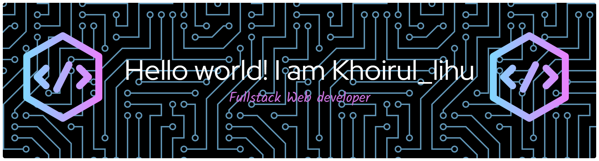

# 👋 Hi there, I'm Irul

## 🚀 About Me

I'm a passionate **Web Developer from Indonesia** who focuses on building modern, responsive, and useful web applications — especially for **education** and **school management** sectors.

### 🔭 I've built:
- 📚 E-Learning Website  
- 🎓 School Management System   
- 🧑‍🏫 Counseling & Monitoring Application  

### 🌱 Currently learning & improving:
- Laravel · PHP · MySQL  
- HTML & CSS · Tailwind CSS · boostrap · JavaScript  
- Full Stack Web Development  

---

## 🛠️ Tech Stack

### Frontend

### Backend

### Database

### Tools

---

## 🧠 Random Dev Quote

---

  

---

## 📫 Let's Connect

 <!-- ganti jika ada -->
 <!-- tambah kalau punya -->

---
<picture>
  <source media="(prefers-color-scheme: dark)" srcset="https://raw.githubusercontent.com/irull894/irull894/pacman-output/pacman-contribution-graph-dark.svg">
  <source media="(prefers-color-scheme: light)" srcset="https://raw.githubusercontent.com/irull894/irull894/pacman-output/pacman-contribution-graph.svg">
  
</picture>

###

---

⭐ **Thanks for visiting!** Let's build something awesome together 🚀